# **CritticWars DevBlog**

This site is for the developers of [CritticWars](https://www.critticwars.com), a text-based browser game to be able to post longer, detailed posts about the development progress of the site whilst keeping announcements in game shorter for players who may not be interested in the detai.

[Deployed site](https://critticwars-dev-blog.herokuapp.com/)

# Contents  

* [Planning Phase](#planning-phase)

# Planning Phase

## Site Aims

CritticWars is a text based browser game that I have been developing. As part of the development process an announcement board is used to post updates that players can see upon logging into the game. However, I tend to keep these as short as possible as not all players like to see the extra detail of how and why a new feature was made, they just want to know its there and how to use it. 
The DevBlog was created to give the players that do want to see the extra information the opportunity to do so. 
The site aims to make it really easy to view the latest blogs and to dive into the blog and read comments. If a user wishes to do so they can then log in and post their own comments on each blog. 

## User Stories
* As an Admin I can...

  * I can create, update, read and delete posts so that I can manage my blog content 
  * I can edit / delete comments so that I can moderate content

* As a Site User I can...

  * Register for an account
  * View Blog posts and their comments
  * Comment on a blog post
  * Like / Unlike a post 
  * See a list of posts / comments that is paginated so that I can easily see the data
  * Edit my own comment
  * Delete my own comment
  * Set my own CritticWars account data so it shows up in the comments

## WireFrames 
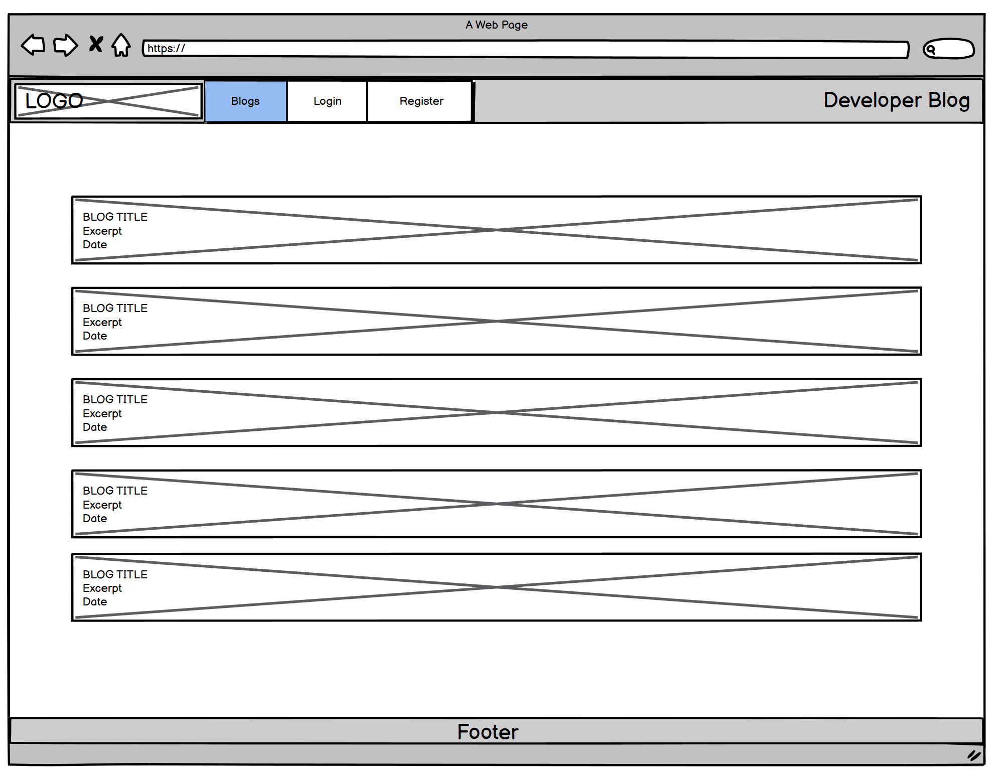
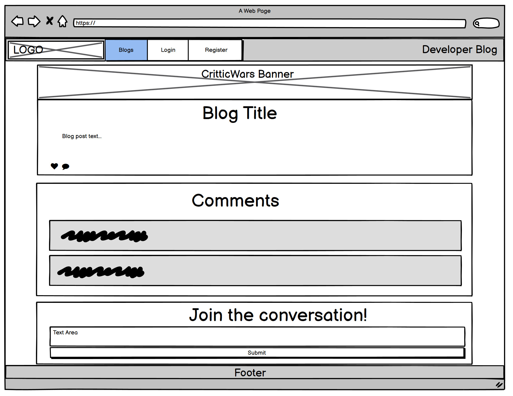
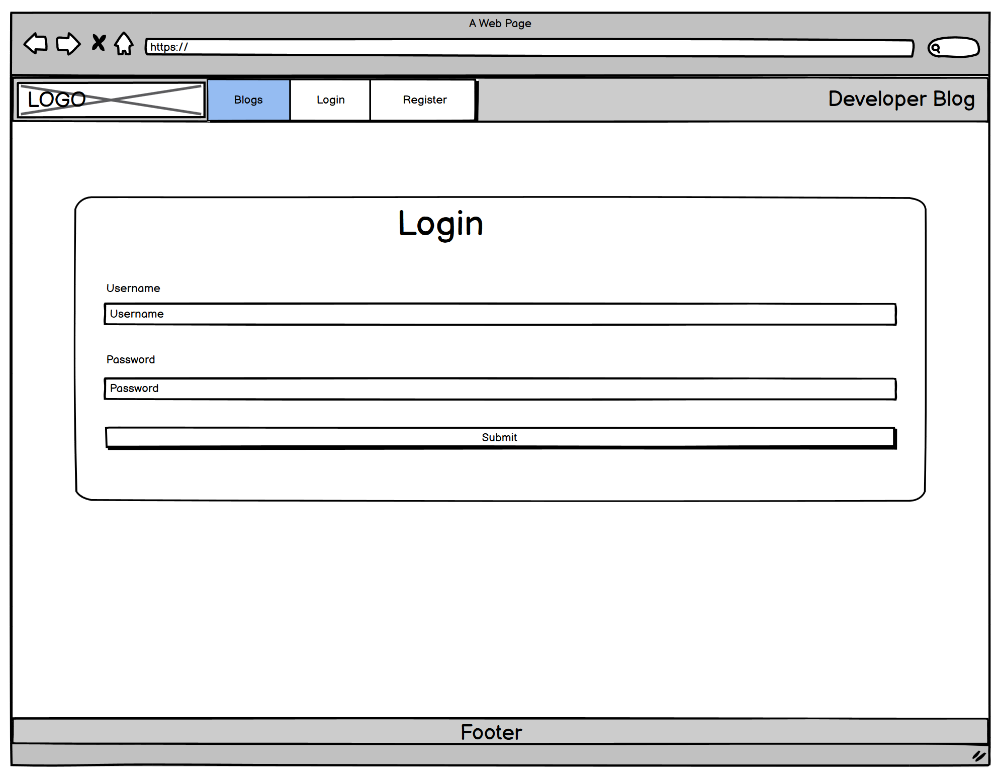
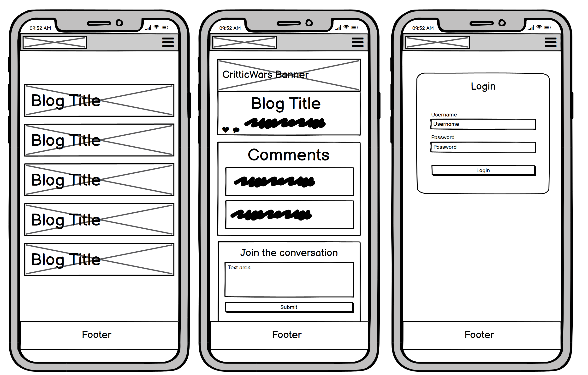 

## Database Schema
[!database](docs/images/wireframes/database-schema.png)
The data base consists of 3 tables. Blogs for blog posts. Comments for comments on blogs and CwUsers for users setting their own CritticWars account details. 
The comments table has a foreign key with the blog table so comments for a particular blog can be fetched and if a blog is deleted, all associated comments are deleted as well. 
All tables are linked to the User table, allowing user specific deletiton should they delete their account.

## Front End Design

### Color Scheme
The colour scheme for the site keeps in line with the overall scheme for CritticWars, opting to utilise the dark mode schema of the site.
For the login pages I went for the general design of the Critticwars site in an effort to let the hero image really shine through, using the same color scheme as the main content areas but with a tint of transparency.  

* Nav Bars and main content areas  
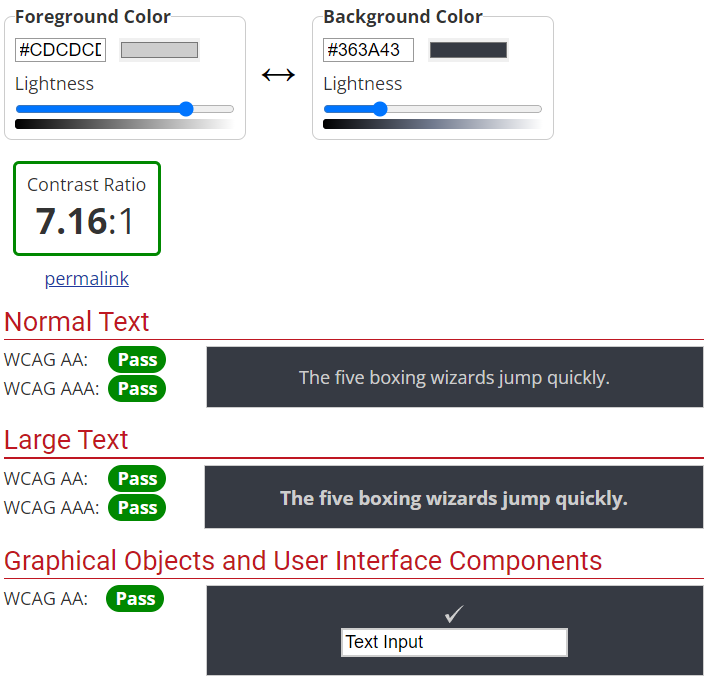  

* Comments Boxes  
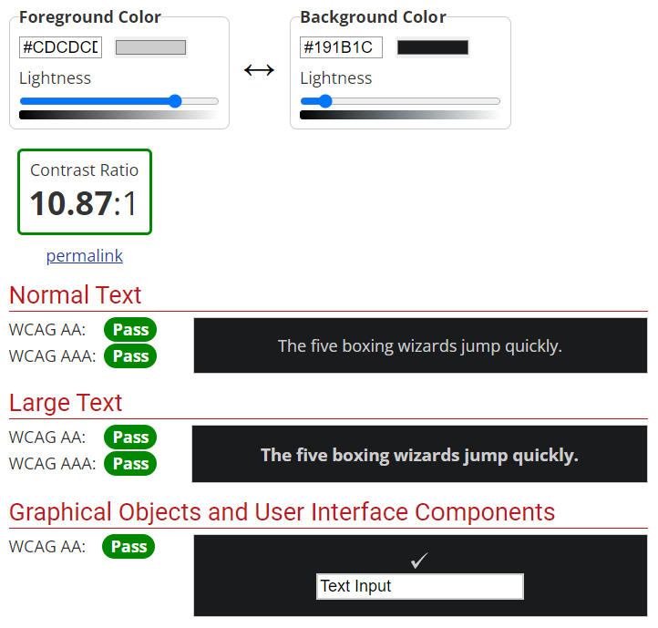

* Buttons
I have tried to use a uniform set of buttons around the site with their color indicating their purpose.
  * Purple - Action (e.g. submit a form or login)  
  * Green - Edit  
  * Blue - Go back  
  * Red - Delete  
  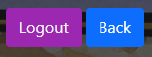  
  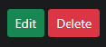

### Typography

For the site two different fonts were used. 

* Amatic SC - This font utilises a Capitilised style and is used on the CritticWars website in most of their banners, making it a great choice to use for Titles in areas across the site.

* Sans-Serif - The default Bootstrap font. The main CritticWars website utilises the condensed Roboto fornt due to its need to fit font into smaller boxes and narrow sidebars whilst also not being a truly full screen layout. For a more full screen design on DevBlog the standard bootstrap font offered excellent readability whilst also being somewhat close to the CritticWars font style so I saw no need to deviate from the default font. 

## Agile Development Process

I used GitHub projects to create User Storys and Bug cards and can be found on the [Git Hub Repository](https://github.com/gibbo101/critticwars-blog/projects/2)

## Features

### Navigation

#### NavBar
The nav bar allows the user to easily navigate around the site.

* Logo: The logo on the nav bar features the CritticWars logo found on the main sites login page and provides a link back to the main site.  

* Signed out
  * When not signed out the user can see the following:
    * Shows Logo (link to CritticWars)
    * Shows link to Blogs (Home page)
    * Shows Login link
    * Shows Register link
    * Shows Develper blog text  

* Loggedin (standard user)
  * When signed out the user can see the following:
    * Shows Logo (link to CritticWars)
    * Shows link to Blogs (Home page)
    * Shows a drop down menu for user settings
    * Shows a link to logout
    * Shows Develper blog text  
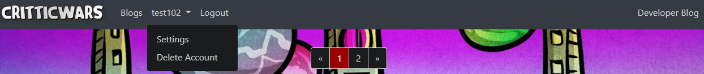

* Loggedin (Admin)
 * Admin users can see all of the above but they also have another drop down menu for accessing the admin panel and creating a blog post
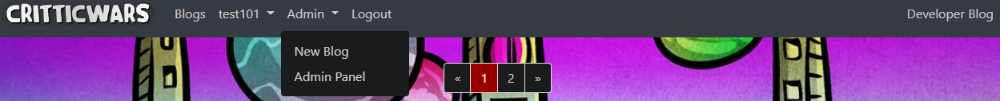

* Responsive Nav
  * The Nav is fully responsive, collapsing down with a hamburger menu and displaying as block when the screen gets smaller  
  
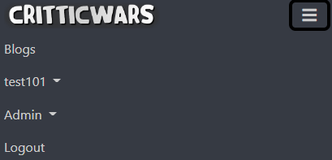  

### Hero Image  
To give a spice of identity and color to the pages, the background utilises a page spanning hero image of the CritticWars login pages.
I wanted something that shouted to the users that this site was a part of CritticWars and the hero image is an iconic CritticWars background. 
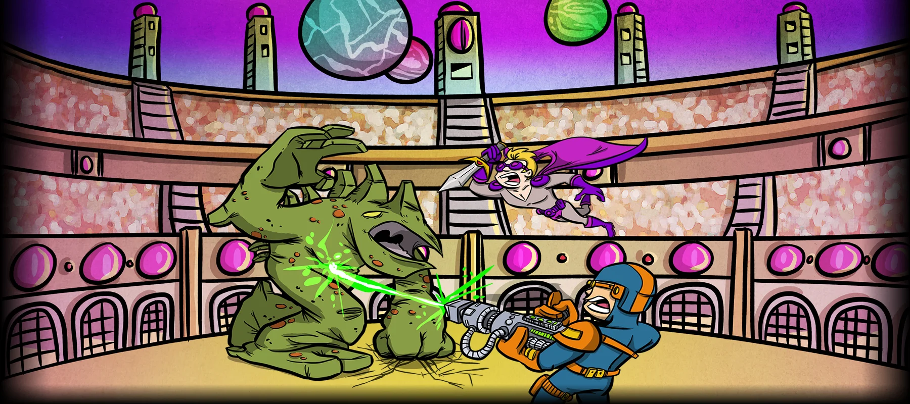

### Blog List (Home Page)
The landing page for the DevBlog shows a paginated list of blog posts. Using a standard Critticwars banner as the blog background it keeps with the CritticWars theme. 
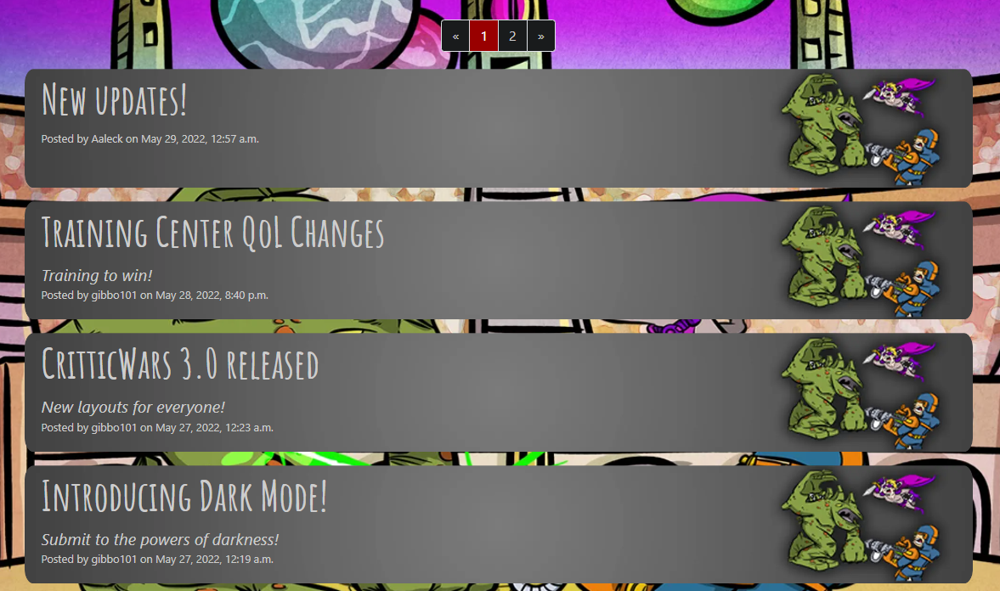

### Blog Post and comments page
The blog post page shows the blog content of the selected post and if there are any comments these are displayed. If the user is logged in they are able to see a text field to input a comment.
Otherwise there is a login link displayed. The blog post has the main CritticWars header as a banner before content is displayed to give the page some life.   
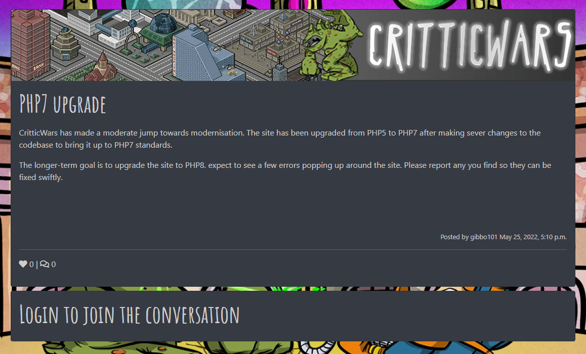  
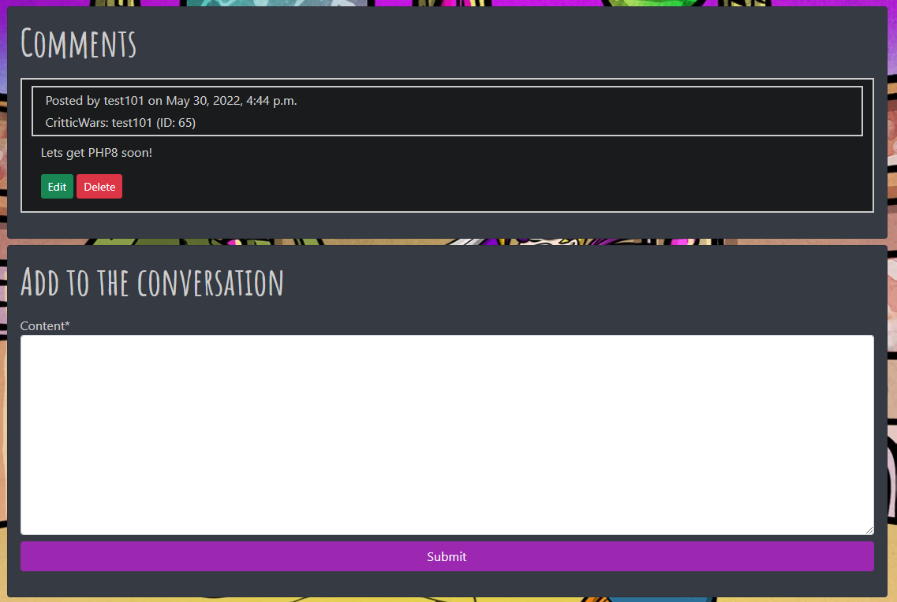

### Edit Comments
The edit comments screen allows users (or admins) to edit their posts. Defensive programming is in place to stop a standard or non logged in user from editing a comment that is not theirs.
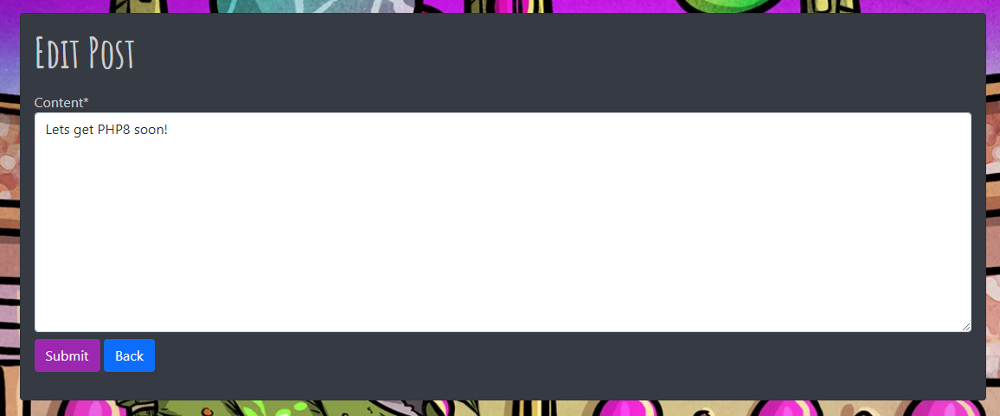
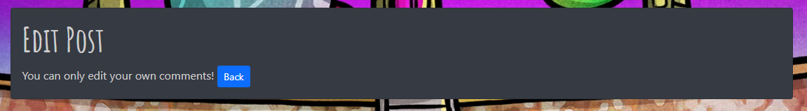

### Delete Comments
The delete comments screen allows users (or admins) to delete their posts. Defensive programming is in place to stop a standard or non logged in user from editing a comment that is not theirs.

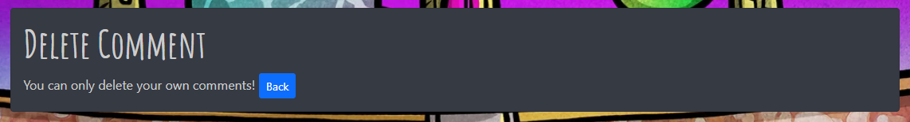

### Account Settings
The account settings page allows a user to set their CritticWars ID and ingame name. Once set this will display on their comments posts. 

### Delete Account
Users can delete their account and this will delete all blog posts and comments associated with the user. A pop up warning will display before the account is deleted.
The style is similar to the login pages to keep consistency with Account creation / deletion.
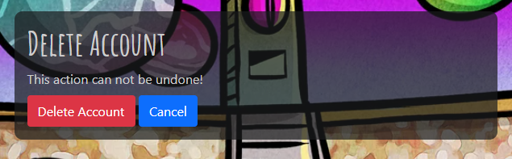

### Account Registraition / Login / Logout
All account registration / login pages have been designed to be similar to the CritticWars login pages. Aiming to bring the hero image into full view the containers utilise a slightly transparent style, giving a good view of the hero image whislt still leaving text easily readable.  
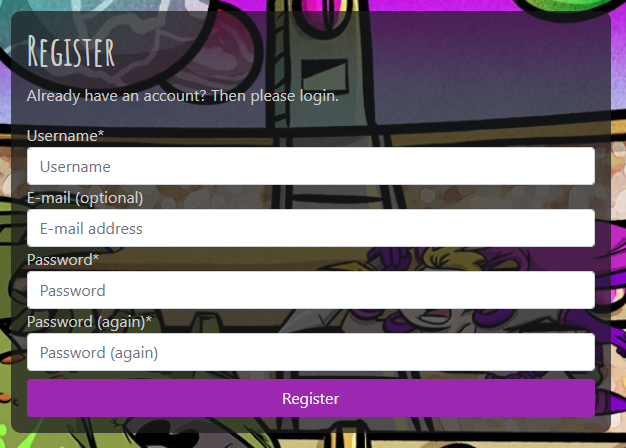  
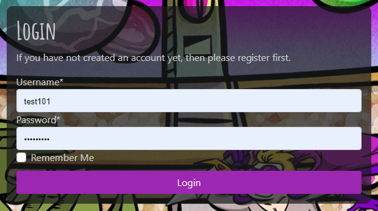  
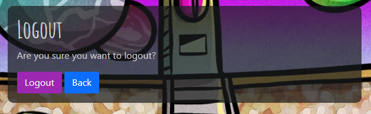  

### Messages
Whenever a user completes an action, a message wil flash at the top of the screen before disappearing after 2 seconds. This happens for actions such as logging out, logging in, posting / editing a commetn etc.  
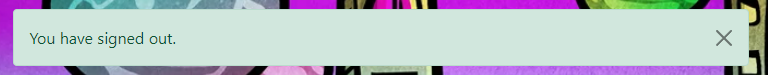

### Pagination  
Pagination appears on the Blog lists screen and on the comments list.  
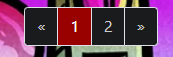

### Footer  
Displays the link to the CritticWars facebook site as well as to the actual CritticWars site.  

### Error pages
I created a custom error page to pick up and 404 or 500 errors that users might get if trying to edit url to get to areas they shouldn't be in.  
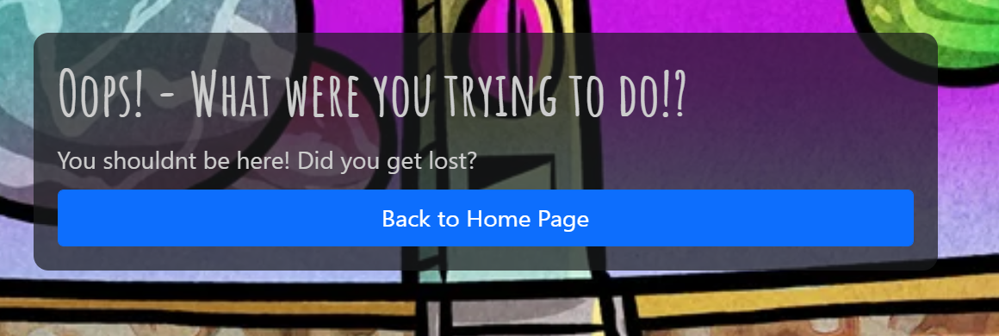

## Future Development

 * Link the devblog to the main critticwars site and merge user accounts so no need to have seperate accounts
 * Implement a feature rich editor for users to use when writing comments.
 * Move creation of blog posts out of the admin panel and allow admins to edit / delete / create blog posts on the main site
 * A notification for users to see if any new comments / blogs when they log in
 * Like button to not refresh the page when clicked

## Testing Phase
All details of testing during and post-development can be found in a seperate file called [TESTING.MD](TESTING.MD)

## Deployment

## Technologies Used
  * Python
    * Installed packages for this project can be found in the [requirements.txt](rrequirements.txt) file
  * Django
    * Django was the framework used for the project. Django AllAuth was used to handle user authentication and related tasks such as logins and registration
  * Heroku
    * Used to deploy the live site and make it publicly available
  * Heroku PostgreSQL
    * The database used during development and deployment
  * HTML
    * The base language that made up the skeleton of all templates
  * CSS
    * Custom css was used to style the site to the correct color scheme and make the site look unique
  * Javascript
    * Whilst javascript wasn't used very much it was utilised to auto close flash messages when users completed tasks
  * Jinja
    * The templating language used to be able to insert logic from my views into my HTML structure.
  * Bootstrap 5
    * Used to style HTML and CSS to allow for rapid templating.
  * Font Awesome
    * For the Facebook, Like and Comments icons

## With thanks
  * [Richard Wells](https://github.com/D0nni387) - My mentor who helped guide me through my project and gave suggestions to push it that little bit further. Thanks!

### Credits
  * Balsamic was used to create the Wireframes
  * Gitpod - Online IDE utilising VS code that was used to develop this project
  * [WebAIM contrast checker](https://webaim.org/resources/contrastchecker/) for checking colour contrast for my chosen color scheme
  * [W3schools](https://www.w3schools.com) for general help when I became stuck
  * [Stackoverflow](https://stackoverflow.com/) for when W3 schools failed me
  * [LevelUp](https://levelup.gitconnected.com/django-customize-404-error-page-72c6b6277317) for custom error pages
  * [Django Documentation](https://docs.djangoproject.com/en/4.0/) for any Django related problems. Most notably using the Paginator
  * [Bootstrap Documentation](https://getbootstrap.com/) for all Bootstrap issues
  * [Code Institute Learning Platform](https://codeinstitute.net/) for reference to course material on how to build a Django app
  * Fonts: Amatic SC was taken from [Google Fonts](https://fonts.google.com/specimen/Amatic+SC?query=amat) and the default font was the bootstrap default

  #### images
  All images were sourced from my website [critticwars.com](https://www.critticwars.com)