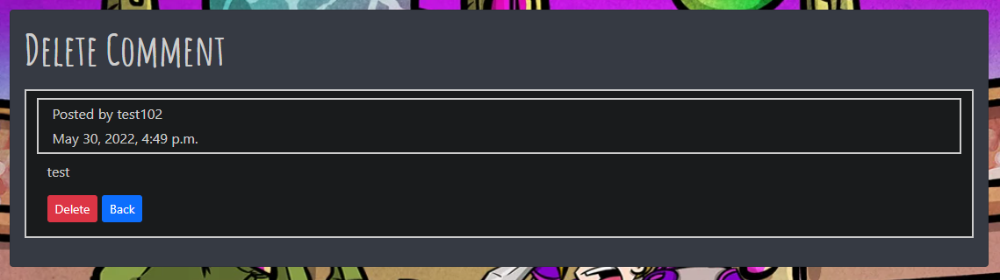

# **CritticWars DevBlog**

This site is for the developers of [CritticWars](https://www.critticwars.com), a text-based browser game, to be able to post longer, detailed posts about the development progress of the site whilst keeping announcements in game shorter for players who may not be interested in the detai.


[Deployed site](https://critticwars-dev-blog.herokuapp.com/)

# Contents  

* [Planning Phase](#planning-phase)
  * [Site Aims](#site-aims)
  * [User Stories](#user-stories)
  * [Wireframes](#wireframes)
  * [Database Schema](#database-schema)
* [Front End Design](#front-end-design)
  * [Color Scheme](#color-scheme)
  * [Typography](#typography)
* [Agile Development Process](#agile-development-process)
* [Features](#features)
  * [Navigation](#navigation)
  * [Hero Image](#hero-image)
  * [Blog List](#blog-list-home-page)
  * [Blog Post and Comments](#blog-post-and-comments)
  * [Edit Comments](#edit-comments)
  * [Delete Comments](#delete-comments)
  * [Delete Account](#delete-account)
  * [Account Authentication](#account-authentication)
  * [Messages](#messages)
  * [Pagination](#pagination)
  * [Footer](#footer)
  * [Error Pages](#error-pages)
* [Future Development](#future-development)
* [Testing Phase](#testing-phase)
* [Deployment](#deployment)
  * [Initial Deployment](#initial-deployment)
  * [Cloning on a local machine or with gitpod](#cloning-on-a-local-machine-or-with-gitpod) 
* [Technologies Used](#technologies-used)
* [With Thanks](#with-thanks)
* [Credits](#credits)
  * [Images](#images)
  

## **Planning Phase**

### **Site Aims**

CritticWars is a text based browser game that I have been developing. As part of the development process an announcement board is used to post updates that players can see upon logging into the game. However, I tend to keep these as short as possible as not all players like to see the extra detail of how and why a new feature was made, they just want to know its there and how to use it. 
The DevBlog was created to give the players that do want to see the extra information the opportunity to do so. 
The site aims to make it really easy to view the latest blogs and to dive into the blog and read comments. If a user wishes to do so they can then log in and post their own comments on each blog. 

### **User Stories**
* As an Admin I can...

  * I can create, update, read and delete posts so that I can manage my blog content 
  * I can edit / delete comments so that I can moderate content

* As a Site User I can...

  * Register for an account
  * View Blog posts and their comments
  * Comment on a blog post
  * Like / Unlike a post 
  * See a list of posts / comments that is paginated so that I can easily see the data
  * Edit my own comment
  * Delete my own comment
  * Set my own CritticWars account data so it shows up in the comments

### **WireFrames**


 

### **Database Schema**

The data base consists of 3 tables. Blogs for blog posts. Comments for comments on blogs and CwUsers for users setting their own CritticWars account details. 
The comments table has a foreign key with the blog table so comments for a particular blog can be fetched and if a blog is deleted, all associated comments are deleted as well. 
All tables are linked to the User table, allowing user specific deletiton should they delete their account.

## **Front End Design**

### Color Scheme
The colour scheme for the site keeps in line with the overall scheme for CritticWars, opting to utilise the dark mode schema of the site.
For the login pages I went for the general design of the Critticwars site in an effort to let the hero image really shine through, using the same color scheme as the main content areas but with a tint of transparency.  

* Nav Bars and main content areas  
  

* Comments Boxes  


* Buttons
I have tried to use a uniform set of buttons around the site with their color indicating their purpose.
  * Purple - Action (e.g. submit a form or login)  
  * Green - Edit  
  * Blue - Go back  
  * Red - Delete  
    
  

### **Typography**

For the site two different fonts were used. 

* Amatic SC - This font utilises a Capitilised style and is used on the CritticWars website in most of their banners, making it a great choice to use for Titles in areas across the site.

* Sans-Serif - The default Bootstrap font. The main CritticWars website utilises the condensed Roboto font due to its need to fit font into smaller boxes and narrow sidebars whilst also not being a truly full screen layout. For a more full screen design on DevBlog the standard bootstrap font offered excellent readability whilst also being somewhat close to the CritticWars font style so I saw no need to deviate from the default font. 

## **Agile Development Process**

I used GitHub projects to create User Storys and Bug cards and can be found on the [Git Hub Repository](https://github.com/gibbo101/critticwars-blog/projects/2)

## **Features**

#### **Navigation**
The nav bar allows the user to easily navigate around the site.

* Logo: The logo on the nav bar features the CritticWars logo found on the main sites login page and provides a link back to the main site.  


* Signed out
  * When not signed out the user can see the following:
    * Shows Logo (link to CritticWars)
    * Shows link to Blogs (Home page)
    * Shows Login link
    * Shows Register link
    * Shows Develper blog text  


* Loggedin (standard user)
  * When signed out the user can see the following:
    * Shows Logo (link to CritticWars)
    * Shows link to Blogs (Home page)
    * Shows a drop down menu for user settings
    * Shows a link to logout
    * Shows Develper blog text  


* Loggedin (Admin)
 * Admin users can see all of the above but they also have another drop down menu for accessing the admin panel and creating a blog post


* Responsive Nav
  * The Nav is fully responsive, collapsing down with a hamburger menu and displaying as block when the screen gets smaller  
  
  

### **Hero Image** 
To give a spice of identity and color to the pages, the background utilises a page spanning hero image of the CritticWars login pages.
I wanted something that shouted to the users that this site was a part of CritticWars and the hero image is an iconic CritticWars background. 


### **Blog List (Home Page)**
The landing page for the DevBlog shows a paginated list of blog posts. Using a standard Critticwars banner as the blog background it keeps with the CritticWars theme. 


### **Blog Post and Comments**
The blog post page shows the blog content of the selected post and if there are any comments these are displayed. If the user is logged in they are able to see a text field to input a comment.
Otherwise there is a login link displayed. The blog post has the main CritticWars header as a banner before content is displayed to give the page some life.   
  


### **Edit Comments**
The edit comments screen allows users (or admins) to edit their posts. Defensive programming is in place to stop a standard or non logged in user from editing a comment that is not theirs.


### **Delete Comments**
The delete comments screen allows users (or admins) to delete their posts. Defensive programming is in place to stop a standard or non logged in user from editing a comment that is not theirs.



### **Account Settings**
The account settings page allows a user to set their CritticWars ID and ingame name. Once set this will display on their comments posts. 


### **Delete Account**
Users can delete their account and this will delete all blog posts and comments associated with the user. A pop up warning will display before the account is deleted.
The style is similar to the login pages to keep consistency with Account creation / deletion.


### **Account Authentication**
All account registration / login pages have been designed to be similar to the CritticWars login pages. Aiming to bring the hero image into full view the containers utilise a slightly transparent style, giving a good view of the hero image whislt still leaving text easily readable.  
  
  
  

### **Messages**
Whenever a user completes an action, a message wil flash at the top of the screen before disappearing after 2 seconds. This happens for actions such as logging out, logging in, posting / editing a comment etc.  


### **Pagination**  
Pagination appears on the Blog lists screen and on the comments list.  


### **Footer**  
Displays the link to the CritticWars facebook site as well as to the actual CritticWars site.  


### **Error pages**
I created a custom error page to pick up and 404 or 500 errors that users might get if trying to edit url to get to areas they shouldn't be in.  


## Future Development

 * Link the devblog to the main critticwars site and merge user accounts so no need to have seperate accounts
 * Implement a feature rich editor for users to use when writing comments.
 * Move creation of blog posts out of the admin panel and allow admins to edit / delete / create blog posts on the main site
 * A notification for users to see if any new comments / blogs when they log in
 * Like button to not refresh the page when clicked

## Testing Phase
All details of testing during and post-development can be found in a seperate file called [TESTING.MD](TESTING.md)

## Deployment

### Initial Deployment
Below are the steps I took to deploy the site to Heroku and any console commands required to initiate it.
#### Create repository:
1. Create a new repository in GitHub and clone it locally following [these instructions](https://docs.github.com/en/repositories/creating-and-managing-repositories/cloning-a-repository)
    * ***Note*** - If you are cloning this project, then you can skip all pip installs below and just run the following command in the terminal to install all the required libraries and packages at once:
       * ```pip3 install -r requirements.txt```
    * ***IMPORTANT*** -  If developing locally on your device, ensure you set up/activate the virtual environment ([see below](#setting-up-the-workspace-to-be-done-locally-via-the-console-of-your-chosen-editor)) before generating the requirements.txt file; failure to do this will pollute your machine and put other projects at risk
   
#### Setting up the Workspace (To be done locally via the console of your chosen editor):
1. Create a virtual environment on your machine (Can be skipped if using gitpod):
    * python -m venv .venv
1. To ensure the virtual environment is not tracked by version control, add .venv to the .gitignore file.
1. Install Django with version 3.2:
    * ```pip3 install django<4 ```
1. Install gunicorn:
    * ```pip3 install gunicorn```
1. Install supporting libraries:
    * ```pip3 install dj_database_url psycopg2```
    * ```pip3 install whitenoise```
    * ```pip3 install django-crispy-forms```
    * ```pip3 install django-summernote```
1. Create requirements.txt:
    * ```pip3 freeze --local > requirements.txt```
1. Create an empty folder for your project in your chosen location.
1. Create a project in the above folder:
    * django-admin startproject <PROJECT_NAME> (in the case of this project, the name was "critticwars")
1. Create an app within the project:
    * ```python3 manage.py startapp APP_NAME``` (in the case of this project, the app name was "devblog")
1. Add a new app to the list of installed apps in setting.py
1. Migrate changes: 
    * ```python3 manage.py migrate```
1. Test server works locally: 
    * ```python3 manage.py runserver```  (You should see the default Django success page)

#### Create Heroku App:
If you already have a [Heroku](https://id.heroku.com/login) account and are logged in, otherwise register a new account or login: 
1. Create a new Heroku app:
    * Click "New" in the top right-hand corner of the landing page, then click "Create new app."
1. Give the app a unique name:
    * Will form part of the URL (in the case of this project, I called the Heroku app critticwars-dev-blog)
1. Select your nearest location:
1. Add a Database to the Heroku app:
    * Navigate to the Resources tab of the app dashboard. Under the heading "Add ons," search for "Heroku Postgres" and click on it when it appears. 
    * Select "Hobby Dev - Free" from the "plan name" drop-down menu and click "Submit Order Form."
1. From your editor, go to your projects settings.py file and copy the SECRET_KEY variable. Add this to the same name variable under the Heroku App's config vars.
    * left box under config vars (variable KEY) = SECRET_KEY
    * right box under config vars (variable VALUE) = Value copied from settings.py in project.

#### Creating Environmental Variables Locally:
1. On your local machine, create a file called ".env" at the same level as settings.py and add this to the .gitignore file.
1. From the Heroku app settings tab, click "reveal config vars" and copy the value of the variable DATABASE_URL. Add this value to a variable called DATABASE_URL in your create .env file:
    * ``` DATABASE_URL="PastedValueFromHerokuHere" ``` - ***(note that with the dotenv package no quotation marks are required)***
    * You can now set DATABASES in settings.py to ``` DATABASES = {
    'default': dj_database_url.parse(os.environ.get('DATABASE_URL'))
}``` to keep it hidden in the .env file
1. From your projects settings.py file, copy the SECRET_KEY value and assign it to a variable called SECRET_KEY in your .env file
    * ``` SECRET_KEY="PastedValueFromYourProjectsSettings.pyFile" ```
    * You can now set your SECRET_KEY in settings.py to ``` SECRET_KEY = os.environ.get('SECRET_KEY') ``` to keep it hidden in the .env file


#### Setting up setting.py File:
1. At the top of your settings.py file, add the following snippet immediately after the other imports:
    ``` 
        import os
        import dj_database_url
        if os.path.isfile('jobsagooden/.env'):  
            from dotenv import load_dotenv  
            load_dotenv()

        SECRET_KEY = os.environ.get("SECRET_KEY")
        DEBUG = "DEVELOPMENT" in os.environ

    ``` 
1. Delete the value from the setting.py DATABASES section and replace it with the following snippet to link up the Heroku Postgres server:  
   
    ```
    DATABASES = {
    'default': dj_database_url.parse(os.environ.get("DATABASE_URL"))
    }
    ```

1. Add whitenoise to the installed apps section of settings.py file:
   
   ```
    INSTALLED_APPS = [
    'whitenoise.runserver_nostatic',
    'django.contrib.staticfiles',
   …,
   ]
   (note: order is important)
   ```

1. Add whitenoise to the middleware section of settings.py file:   

  MIDDLEWARE = [
    'django.middleware.security.SecurityMiddleware',
    'whitenoise.middleware.WhiteNoiseMiddleware',
    ...,
    ]
    ```

1. Tell Django to use Whitenoise to store media and static files by placing this snippet under the comments indicated below:
    ```
    STATIC_URL = '/static/'
    STATICFILES_STORAGE = 'whitenoise.storage.CompressedManifestStaticFilesStorage'
    STATICFILES_DIRS = [os.path.join(BASE_DIR, 'static')]
    STATIC_ROOT = os.path.join(BASE_DIR, 'staticfiles')
    ```

1. Under the line with BASE_DIR, link templates directly in Heroku via settings.py:
   * ``` TEMPLATES_DIR = os.path.join(BASE_DIR, 'templates') ```

1. Within TEMPLATES array, add ``` 'DIRS':[TEMPLATES_DIR] ``` like the below example:
```
   TEMPLATES = [
       {
           …,
           'DIRS': [TEMPLATES_DIR],
           …,
          
        },
       },
   ]
```

1. Other apps to add to INSTALLED APPS in settings.py:
  * Ensure all other apps installed earlier are added to installed apps
  ```
  'django_summernote',
    'crispy_forms',
  ```
1.
 * Crispy Forms: Add the following in your settings.py file:
```CRISPY_TEMPLATE_PACK = 'bootstrap4'```

1. Add allowed hosts to settings.py:
    * ``` ALLOWED_HOSTS = ["PROJECT_NAME.herokuapp.com", "localhost"] ``` 

1. Create Procfile at the top level of the file structure and insert the following:
    * ``` web: gunicorn PROJECT_NAME.wsgi ```

1. Make an initial commit and push the code to the GitHub Repository.
    * ```git add .```
    * ```git commit -m "Initial deployment"```
    * ```git push```

#### Set up Heroku for use via the console.
1. Click on Account Settings (under the avatar menu)
1. Scroll down to the API Key section and click Reveal. Copy the API key.
1. Log in to Heroku via the console and enter your details.
    * heroku login-i
    * When prompted, enter your Heroku username
    * Enter copied API key as the password

1. Get your app name from Heroku
    * ```heroku apps```
1. Set Heroku remote
    * ```heroku git:remote -a <app_name>```
1. Add, Commit, Pust to GitHub:
    * ```git add . && git commit -m "Deploy to Heroku via CLI"```
1. Push to GitHub and Heroku
    * ```git push origin main```
    * ```git push heroku main ``` 

### Cloning on a Local machine or with Gitpod
1. Navigate to the [GitHub repository](https://github.com/gibbo101/critticwars-blog), and follow [these steps to clone the project](https://docs.github.com/en/repositories/creating-and-managing-repositories/cloning-a-repository) into your IDE of choice.   
   
   * **Gitpod** only **requires** you to have the **web extension** installed and **click** the **green Gitpod button** from the repositories main page. If you are **using Gitpod**, please **skip step 2** below as you do not require a virtual environment to protect your machine.  
  
1. **Create** the **virtual environment** with the terminal command **```python3 -m venv venv```.** Once complete add the "venv" file to you're ".gitignore" file and use the terminal command **```venv\Scripts\activate.bat``` to activate it.**
   
   * ***IMPORTANT*** If developing locally on your device, ensure you **set up/activate the virtual environment before installing/generating the requirements.txt file**; failure to do this will pollute your machine and put other projects at risk.
 
1. **Install the requirements** listed in requirements.txt using the terminal command  **```pip3 install -r requirements.txt```**
   * **I have already included a requirements.txt for this app** by using the terminal command **```pip3 freeze > requirements.txt```** to create it.

1. **[Create your own Heroku app](#create-heroku-app)**, and update allowed hosts in settings.py.
   
1. **[Create your .env file](#creating-environmental-variables-locally).

1. **Run server locally** with ``` python3 mange.py runserver ```

1. Enjoy!

## Technologies Used
  * Python
    * Installed packages for this project can be found in the [requirements.txt](rrequirements.txt) file
  * Django
    * Django was the framework used for the project. Django AllAuth was used to handle user authentication and related tasks such as logins and registration
  * Heroku
    * Used to deploy the live site and make it publicly available
  * Heroku PostgreSQL
    * The database used during development and deployment
  * HTML
    * The base language that made up the skeleton of all templates
  * CSS
    * Custom css was used to style the site to the correct color scheme and make the site look unique
  * Javascript
    * Whilst javascript wasn't used very much it was utilised to auto close flash messages when users completed tasks
  * Jinja
    * The templating language used to be able to insert logic from my views into my HTML structure.
  * Bootstrap 5
    * Used to style HTML and CSS to allow for rapid templating.
  * Font Awesome
    * For the Facebook, Like and Comments icons

## With Thanks
  * [Richard Wells](https://github.com/D0nni387) - My mentor who helped guide me through my project and gave suggestions to push it that little bit further. Thanks!


## Credits
  * Balsamic was used to create the Wireframes
  * Gitpod - Online IDE utilising VS code that was used to develop this project
  * [WebAIM contrast checker](https://webaim.org/resources/contrastchecker/) for checking colour contrast for my chosen color scheme
  * [W3schools](https://www.w3schools.com) for general help when I became stuck
  * [Stackoverflow](https://stackoverflow.com/) for when W3 schools failed me
  * [Whitenoise](http://whitenoise.evans.io/en/stable/django.html) instructions on how to setup whitenoise
  * [LevelUp](https://levelup.gitconnected.com/django-customize-404-error-page-72c6b6277317) for custom error pages
  * [Django Documentation](https://docs.djangoproject.com/en/4.0/) for any Django related problems. Most notably using the Paginator
  * [Bootstrap Documentation](https://getbootstrap.com/) for all Bootstrap issues
  * [Code Institute Learning Platform](https://codeinstitute.net/) for reference to course material on how to build a Django app
  * Fonts: Amatic SC was taken from [Google Fonts](https://fonts.google.com/specimen/Amatic+SC?query=amat) and the default font was the bootstrap default

### Images
All images were sourced from my website [critticwars.com](https://www.critticwars.com)