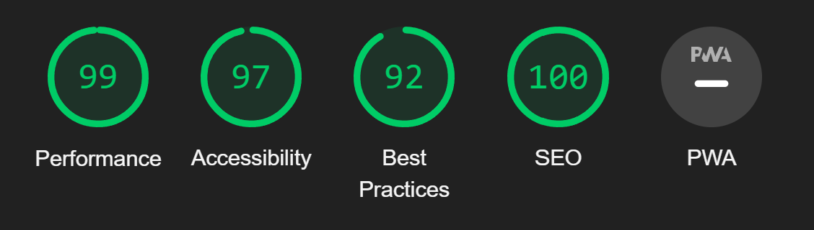

# Manual Testing
* [Bugs and Fixes During the Development Process](#bugs-and-fixes-during-the-development-process)
* [Lighthouse](#lighthouse)
* [Validators](#validators)
* [Manual Testing](#manual-testing)

## Bugs and Fixes During the Development Process
Below is a list of bugs and fixes found whilst creating the project. Most are listed on the [GitHub Projects Board(https://github.com/gibbo101/critticwars-blog/projects/2)]
As bugs were discovered through the sprint a card was made to then fix it.

### Issue: Heroku Deployment
* Cause: When deploying to Heroku I was getting an error. Upon looking at the logs, there was an error with backports, which was being put in the requirements.tx file when running pip3 freeze --local > rrequirements.txt
* Fix: Removed backports from the requirements.txt file.

### Issue: Blog posts not showing in a list
* Cause: Called incorrect blog variable 
    
    
{{ blog.title }}, {{ blog.author }}

* Fix: changed Blog to blog

### Issue: Add comment form not working
* Cause: Incorrect use of form tags.
* Fix: form action="post" set to form method="post"

### Issue: Likes not working
* Cause: Incorrect arguments called
* Fix: Added *args, **kwargs to method

### Issue: Account Signup link not working
* Cause: Incorrect URL path being called
* Fix: Call correct url path of 'account_signup'

### Issue: Cloudinary not serving static files on Heroku
* Cause: Unknown. After some research I still couldn't determine why Cloudinary wasn't working
* Fix: Switched to whitenoise to serve static files

### Issue: Whitnoise not working correctly
* Cause: Incorrect configuration in middleware and installed apps in settings.py
* Fix: Set whitenoise configuration to the correct order in the middlewaree and apps lists

### Issue: Account registration causing errors
* Cause: Nothing configured to send confirmation emails in django
* Fix: ACCOUNT_EMAIL_VERIFICATION = 'none' in settings.py to disable verification emails

 ### Issue: Updated table not recognised on Heroku
* Cause: Adding to database models and then testing mistakenly on Heorku rather than the local server. I then made some migrations in an attempt to roll back the database but ended up breaking local environment as well and could not restore db table to fix. 
* Fix: Hard reset of git repository to the night before and a fake roll back of db migrations to then re-run old migrations to fix.

### Issue: When deleting a user their comments don't delete
* Cause: Comments table not linked to Users
* Fix: Add a ForeignKey row into the Comments table and cascade on delete

### Issue: Creating the CwUsers table and showing name in the comments
* Cause: Unable to hook into Comments and compare names
* Fix: Set ForeignKey in CwUsers to reference User and Comments table. In views.py got all CwUser instances and allowed accass in the html file where I then looped whilst in the comments loop. If names didnt match or cw_id was not 0 then it displays CritticWars character name and ID.

### Issue: On delete account page, back button was also deleting account(and without safety alert)
* Cause: Button tag was within form tags.
* Fix: Set button type="button" and this stopped it submiting within the form tags.

### Issue: Pagination for comments broke comments count and CritticWars charactger names showing
* Cause: paginator takes comments in views.py a value to determine pagination causing comments in the template to show as "Page 1 of 1"
* Fix: set a new variable of new_comments = comments before pagination called and use this to determine number of comments and rename cw_comments to cw_users in template. 

### Issue: Flash messages showing underneath nav bar
* Cause: Setting nav bar to be fixed to the top of the screen.
* Fix: Move flash messages into the main tag and set margins to push content below the nav bar

# Lighthouse
The lighthouse test showed a reduced score for accessibility as the nav bar had 2 drop down items. The error was "duplicate id elements." I fixed this by changing the id to a class. 

## Blog List
### Desktop

### Mobile

## Blog Post and Comments
### Desktop
* Initial score for Best Practice was 83 due to using a low res image. This has now been resolved.

### Mobile

## User Settings
### Desktop

### Mobile

## Delete Account
### Desktop

### Mobile

## Edit Comments
### Desktop

### Mobile

## Delete Comments
### Desktop

### Mobile

## Log Out
### Desktop

### Mobile

## Login
### Desktop

### Mobile

# Validators
## [HTML](https://validator.w3.org):

Pages were free from errors, except those noted below.

* An error was thrown for using a div tag as a child of a h5 tag on the blog post comments page and the edit and delete comments pages. These have now been fixed.
* There was also an error for no alt tag in an image but this was from a blog post input where I had no control over the image being posted. 

* Otherwise the site was free of errors.

## [CSS](https://jigsaw.w3.org/css-validator/):
My CSS file was tested and found to be free from errors

## [JS](https://jshint.com/):
No errors were found using JShint. 

## [PEP8](http://pep8online.com):
The following errors were found when running through the pep8 checker. 
* devblog/admin.py - 	missing whitespace after ','
* devblog/models.py - line too long, too many blank lines, expected 2 blank lines, found 1
* devblog/urls.py - line too long
* critticwars/settings.py - line too long

# Manual Testing 
Below is a summary of the manual testing carried out for each user story.

## As an Admin I can..

This mostly comprised of checking the admin panel, however, I also added in a feature where an admin can edit / delete anyones comments from within the main site.

* I can create, update, read and delete posts so that I can manage my blog content  
&check; Can create a new blog post in the admin panel using the summer note editor  
&check; Can delete a blog post from the admin panel  
&check; Can update a blog post from the admin panel  
&check; Can update a blog post from the admin panel  
&check; Can filter by date created from the admin panel  
&check; Links on the nav bar to the admin panel and create blog post are only visible to admins

* I can edit / delete comments so that I can moderate content  
&check; Admin users can see an Edit / Delete button on every comment
&check; Admin users can access the edit / delete comment screens if the comment is no theirs
&check; Admin users can edit / delete the comment from the edit / delete comment screens if the comment is not theirs

## As a Unregistered User I can... 
* View Blog posts and their comments
&check; Anyone can see blog posts regardless of loggedin status
&check; Anyone can see blog content and comments regardless of loggedin status
&check; The input comment box does not show and is replaced with a link to the login page

* Register for an account  
&check; Loggout or unregistered users can see a Register link in the nav bar.  
&check; The register page successfully registers a user for a new account.  
&check; Logged out users can see a login link on the nav bar and access it to log in to the site  

## As a Site User (logged in) I can...  
* Like / Unlike a post  
&check; Clicking on the like button adds a like if the user hasn't liked the post already.  
&check; Clicking on the like button removes a like if the user has already liked the post  
&check; Users that are not logged in are unable to press the like button.

* Comment on a blog post  
&check; Comments box shows to users who are logged in  
&check; Users can not submit an empty comment  
&check; Once submitted the comment shows in the comments list with the correct users name and posted date attached  

* Edit my own comment  
&check; Users can see an edit button on their own comments only  
&check; Users can access the edit comment screen which displays their post details in a ready filled edit box  
&check; Users who try to manipulate the url to a post id that is not theirs get an error message or a 404 if the post does not exist

* Delete my own comment  
&check; Users can see an delete button on their own comments only  
&check; Users can access the delete comment screen which displays their post details in a ready filled edit box  
&check; Users who try to manipulate the url to a post id that is not theirs get an error message or a 404 if the post does not exist

* See a list of posts / comments that is paginated so that I can easily see the data
&check; Pagination buttons show when there is more than 10 comments on the blog post screen or more than 10 blogs on the home page  
&check; By manually changing tha pagination number I could see the pagination buttons changing  
&check; If on the last or first page the respective next page buttons are disabled, as is the current page

* Set my own CritticWars account data so it shows up in the comments  
&check; Registered users can see an account settings drop down in the nav bar  
&check; Registered users can access the account settings screen  
&check; Registered users see their own data in the account settings screen  
&check; Registered users can change their data which updates their comments to show their Critticwars screen name and if their ID > 0, shows their ID  
&check; The comments screen shows a users Critticwars name and it doesn't show on an incorrect users comment

[Back to Readme](README.md)