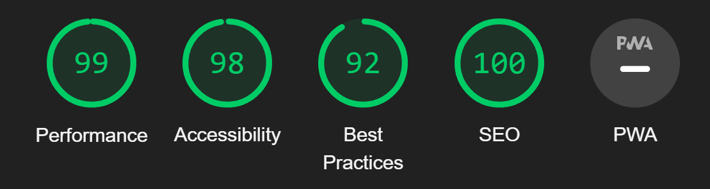

# Manual Testing
* [Manuel Testing](#manual-testing)
  * [Bugs and Fixes During the Development Process]
  (#bugs-and-fixes-during-the-development-process)
* Lighthouse(#lighthouse)
  * 

## Bugs and Fixes During the Development Process
Below is a list of bugs and fixes found whilst creating the project. Most are listed on the [GitHub Projects Board(https://github.com/gibbo101/critticwars-blog/projects/2)]
As bugs were discovered through the sprint a card was made to then fix it.

### Issue: Heroku Deployment
* Cause: When deploying to Heroku I was getting an error. Upon looking at the logs, there was an error with backports, which was being put in the requirements.tx file when running pip3 freeze --local > rrequirements.txt
* Fix: Removed backports from the requirements.txt file.

### Issue: Blog posts not showing in a list
* Cause: Called incorrect blog variable 
    
    
{{ blog.title }}, {{ blog.author }}

* Fix: changed Blog to blog

### Issue: Add comment form not working
* Cause: Incorrect use of form tags.
* Fix: form action="post" set to form method="post"

### Issue: Likes not working
* Cause: Incorrect arguments called
* Fix: Added *args, **kwargs to method

### Issue: Account Signup link not working
* Cause: Incorrect URL path being called
* Fix: Call correct url path of 'account_signup'

### Issue: Cloudinary not serving static files on Heroku
* Cause: Unknown. After some research I still couldn't determine why Cloudinary wasn't working
* Fix: Switched to whitenoise to serve static files

### Issue: Whitnoise not working correctly
* Cause: Incorrect configuration in middleware and installed apps in settings.py
* Fix: Set whitenoise configuration to the correct order in the middlewaree and apps lists

### Issue: Account registration causing errors
* Cause: Nothing configured to send confirmation emails in django
* Fix: ACCOUNT_EMAIL_VERIFICATION = 'none' in settings.py to disable verification emails

 ### Issue: Updated table not recognised on Heroku
* Cause: Adding to database models and then testing mistakenly on Heorku rather than the local server. I then made some migrations in an attempt to roll back the database but ended up breaking local environment as well and could not restore db table to fix. 
* Fix: Hard reset of git repository to the night before and a fake roll back of db migrations to then re-run old migrations to fix.

### Issue: When deleting a user their comments don't delete
* Cause: Comments table not linked to Users
* Fix: Add a ForeignKey row into the Comments table and cascade on delete

### Issue: Creating the CwUsers table and showing name in the comments
* Cause: Unable to hook into Comments and compare names
* Fix: Set ForeignKey in CwUsers to reference User and Comments table. In views.py got all CwUser instances and allowed accass in the html file where I then looped whilst in the comments loop. If names didnt match or cw_id was not 0 then it displays CritticWars character name and ID.

### Issue: On delete account page, back button was also deleting account(and without safety alert)
* Cause: Button tag was within form tags.
* Fix: Set button type="button" and this stopped it submiting within the form tags.

### Issue: Pagination for comments broke comments count and CritticWars charactger names showing
* Cause: paginator takes comments in views.py a value to determine pagination causing comments in the template to show as "Page 1 of 1"
* Fix: set a new variable of new_comments = comments before pagination called and use this to determine number of comments and rename cw_comments to cw_users in template. 

### Issue: Flash messages showing underneath nav bar
* Cause: Setting nav bar to be fixed to the top of the screen.
* Fix: Move flash messages into the main tag and set margins to push content below the nav bar

# Lighthouse
The lighthouse test showed a reduced score for accessibility as the nav bar had 2 drop down items. The error was "duplicate id elements." I fixed this by changing the id to a class. 

##Blog List
### Desktop

### Mobile

##Blog Post and Comments
### Desktop

### Mobile

